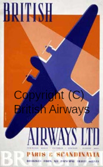

# k22_posters
Raw postscript posters featuring the Klingon K-22 "Bird of Prey"

## Klingon Spaceways

[PDF](https://github.com/gnewton/k22_posters/raw/main/pdf/klingon_spaceways.pdf)
|
[PNG Image](https://github.com/gnewton/k22_posters/raw/main/png/klingon_spaceways.png) 
                                                                                        
Inspired by:

(C) British Airways

[Original](https://www.britishairways.com/assets/images/information/about-ba/history-and-heritage/posters/1920-1939/lightbox/384x620-British-Airways-Paris-Scandinavia-poster.jpg)

## Art Deco K-22

[PDF](https://github.com/gnewton/k22_posters/raw/main/pdf/k22-artdeco.pdf)
|
[PNG image](https://github.com/gnewton/k22_posters/raw/main/png/k22-artdeco.png)

## Abstract "Revenge is a dish best..." with multiple K-22s, some coming in/out of cloak

[PDF](https://github.com/gnewton/k22_posters/raw/main/pdf/revenge.pdf)
|
[PNG image](https://github.com/gnewton/k22_posters/raw/main/png/revenge.png)

# Dependencies
## Building
make, [ghostscript](https://www.ghostscript.com/), [ImageMajick](https://imagemagick.org/) [convert](https://imagemagick.org/script/convert.php)
## Postscript Fonts
### Klingon
`revenge.ps` uses: 
[pIqaDRoman font](https://hol.kag.org/page/piqadsupport.html). Thanks to  [David Peterson](https://twitter.com/Dedalvs) for this font.
## Building
`make clean; make`
