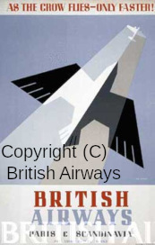

An experimental Covid side project, so improve my Postscript skills.

# Klingon K-22 Postscript Posters
Raw Postscript posters featuring the Klingon [K-22 "Bird of Prey"](https://www.ststcsolda.space/klingons/K-22/K-22.html)

All posters written in raw Postscript without any other tools.

K-22 outline used in all posters converted to Postscript by eye/hand.

Builds PDF and PNG images.

## License

### Postscript code
GPL3

### PNG and PDF output
[CC BY-NC 4.0](https://creativecommons.org/licenses/by-nc/4.0/)

## Klingon Spaceways
These are inspired by two British Airways Paris-Scandinavia posters from the [1920s/30s](https://www.britishairways.com/en-ca/information/about-ba/history-and-heritage/posters/posters-1920-1939)

### Klingon Spaceways 1

    
    Inspired by:
    

[PDF](https://github.com/gnewton/k22_posters/raw/main/pdf/klingon_spaceways.pdf)
|
[PNG Image](https://github.com/gnewton/k22_posters/raw/main/png/klingon_spaceways.png) 
                                                                                        
[Original British-Airways-Paris-Scandinavia](https://www.britishairways.com/assets/images/information/about-ba/history-and-heritage/posters/1920-1939/lightbox/384x620-British-Airways-Paris-Scandinavia-poster.jpg)

### Klingon Spaceways 2

    
    Inspired by:
    

[PDF](https://github.com/gnewton/k22_posters/raw/main/pdf/klingon_spaceways_bird.pdf)
|
[PNG Image](https://github.com/gnewton/k22_posters/raw/main/png/klingon_spaceways_bird.png) 

[Original British-Airways-Paris-Scandinavia](https://www.britishairways.com/assets/images/information/about-ba/history-and-heritage/posters/1920-1939/lightbox/395x620-British-Airways-as-the-crow-flies-poster.jpg)

### Issues
1. Fonts are not exactly like the original. May look into this.
1. Agreed: a K-22 with accommodation for twelve would not make a good spacecraft for an interplanetary spacelines. :-)

## Art Deco K-22

[PDF](https://github.com/gnewton/k22_posters/raw/main/pdf/k22-artdeco.pdf)
|
[PNG image](https://github.com/gnewton/k22_posters/raw/main/png/k22-artdeco.png)

## Abstract "Revenge is a dish best..." with multiple K-22s, some coming in/out of cloak

[PDF](https://github.com/gnewton/k22_posters/raw/main/pdf/revenge.pdf)
|
[PNG image](https://github.com/gnewton/k22_posters/raw/main/png/revenge.png)

# Dependencies
## Building
make, [ghostscript](https://www.ghostscript.com/), [ImageMajick](https://imagemagick.org/) [convert](https://imagemagick.org/script/convert.php)
## Postscript Fonts
### Klingon
`revenge.ps` uses: 
[pIqaDRoman font](https://hol.kag.org/page/piqadsupport.html). Thanks to  [David Peterson](https://twitter.com/Dedalvs) for this font.
## Building
`make clean; make`

# Related repos
- [Recreation of Michener 1997 diagram](https://github.com/gnewton/michener1997) - LaTeX
- [Recreation of Crossan,Lane & White 1999 diagram](https://github.com/gnewton/clw1999) - LaTeX
- [Manipulate PDF to make a cleaner Gatineau Park tail map](https://github.com/gnewton/gatineauPdfFun) - PDF, Postscript
